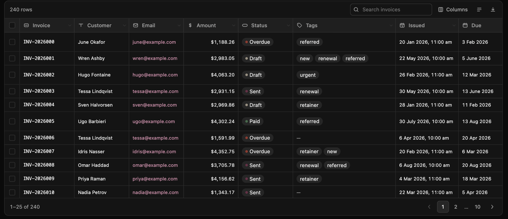

# Trapezium

A data table that looks right before you configure anything.

```tsx
import { Table } from "@trapezium/react"
import "@trapezium/react/styles.css"

export function People({ users }) {
  return <Table data={users} />
}
```

That is a complete usage. Columns come from the data, types from the values, and sorting, searching and pagination work. Everything else in these docs is for the cases where the default is not what you want.



## Why another one

Every table library fails in the same three ways. **TanStack Table** is excellent underneath and hands you a pile of primitives — you write four hundred lines before a row appears, and then you own the styling, the accessibility, the pagination UI and the filter controls forever. **AG Grid** does everything, weighs a fortune, looks like enterprise reporting software, and puts the parts people actually need behind a licence. **MUI DataGrid** brings a whole design system with it. **shadcn's table** is a `<table>` with borders on it.

Trapezium is the one that is beautiful out of the box, configured in five lines, and still lets you replace anything.

- **Nothing to configure to start.** Columns, headers, types, alignment, formatting and filter controls are all inferred, and every one of them is one property to override.
- **Plug your data straight in.** A Postgres row, a Supabase response, a REST payload, a Prisma model. No mapping layer, no wrapper types, dotted paths for nested fields.
- **Real filtering and search.** Per-column filters that suit the column's type, including a set filter built from the values actually present, plus global search across everything.
- **Four kinds of pagination.** Numbered, previous/next, load more, infinite scroll. One prop.
- **Server or client.** The same component sorts and pages your array, or tells you what to fetch.
- **Server rendering that actually works.** Correct on the first paint, no effects, no layout shift, and optionally no client JavaScript at all.
- **Styled by CSS variables**, so it matches your app by overriding a few tokens — or hand it Tailwind classes per slot and take over completely.
- **Accessible by default.** Real table semantics, `aria-sort`, keyboard-operable menus, focus returned properly, AA contrast in both themes.
- **No dependencies.** Not React-only underneath, not an icon library, not a date library, not a popover library.
- **Small.** About 29 kB of JavaScript gzipped for the React table and its engine, plus 6 kB of CSS — everything above included.

## Install

```sh
npm install @trapezium/react     # React 18 or 19, Next.js, Remix, Vite, Astro
npm install @trapezium/vue       # Vue 3, Nuxt
npm install @trapezium/svelte    # Svelte 5, SvelteKit
npm install @trapezium/vanilla   # plain JavaScript, or a script tag
npm install @trapezium/core      # headless: bind your own renderer
```

Then import the stylesheet once, anywhere:

```ts
import "@trapezium/react/styles.css"
```

## The five-minute version

```tsx
<Table
  data={invoices}
  getRowId={(invoice) => invoice.id}
  search
  selection
  onSelectionChange={(ids) => setSelected(ids)}
  pagination={{ mode: "pages", pageSize: 25 }}
  columns={[
    { key: "reference", header: "Invoice", pin: "start" },
    { key: "customer.name", header: "Customer" },
    { key: "amount", type: "currency", filter: "range" },
    { key: "status", type: "badge", formatOptions: { options: STATUSES } },
    { key: "due_date", header: "Due", type: "date" },
    { key: "actions", header: "", render: ({ row }) => <RowMenu id={row.id} /> },
  ]}
/>
```

Every property there is optional. Delete any of them and the table still works.

## Documentation

| | |
|---|---|
| [Getting started](docs/getting-started.md) | Install, first table, the framework you use |
| [Columns](docs/columns.md) | Keys, headers, accessors, widths, pinning, visibility |
| [Types](docs/types.md) | The built-in types, and writing your own |
| [Filtering and search](docs/filtering.md) | Per-column filters, set filters, operators, global search |
| [Pagination](docs/pagination.md) | The four modes, and page size |
| [Selection](docs/selection.md) | Single, multiple, ranges, row identity |
| [Custom rendering](docs/rendering.md) | Cells, headers, formatters, links, actions |
| [Styling](docs/styling.md) | Tokens, dark mode, Tailwind, shadcn, density |
| [Server-side data](docs/server-data.md) | Sorting, filtering and paging in your database |
| [Server rendering and URL state](docs/ssr.md) | SSR, shareable links, tables with no JavaScript |
| [Accessibility](docs/accessibility.md) | What you get, and what is still yours |
| [API reference](docs/api.md) | Every prop, type and function |
| [Recipes](docs/recipes.md) | The things people ask for |
| [Migrating](docs/migrating.md) | From TanStack Table, AG Grid and MUI DataGrid |

Building an agent or working with one? [`llms.txt`](llms.txt) is the whole API in a single file.

## Examples

Every example in [`examples/`](examples) runs against the local packages.

| | | |
|---|---|---|
| [`playground`](examples/playground) | React | Every feature on one page. `pnpm build`, then open `dist/index.html` |
| [`next-server`](examples/next-server) | Next.js | Sorting, filtering and paging in the database, all of it in the URL. `pnpm dev` |
| [`vue-app`](examples/vue-app) | Vue 3 | Including a cell that renders a real Vue component. `pnpm dev` |
| [`svelte-app`](examples/svelte-app) | Svelte 5 | Runes, `bind:tableState`, and the action. `pnpm dev` |
| [`plain-html`](examples/plain-html) | None | One file, one script tag, no build step |

## Licence

MIT.

## Working on it

```sh
pnpm install
pnpm build       # every package
pnpm test        # 176 tests: core, React, Vue, Svelte, vanilla
pnpm typecheck
pnpm check       # typecheck and test together
```

The core is framework-agnostic and has no dependencies; each adapter binds it to a rendering layer and renders **the same DOM with the same class names**, so the stylesheet ships once and a fix lands everywhere. If you change markup in one adapter, change it in the others.
